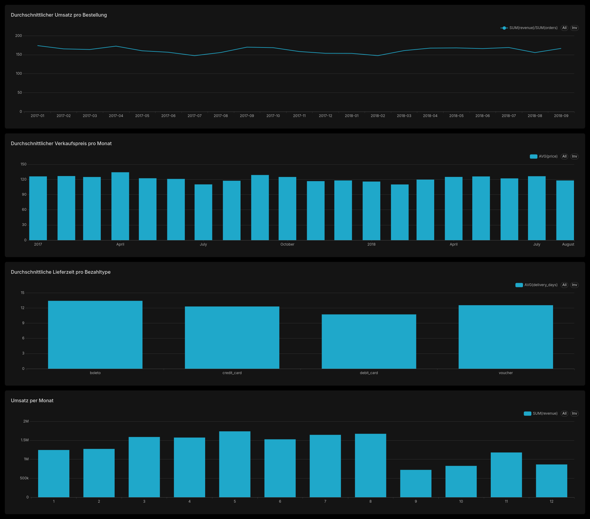

# PySpark Analytics Pipeline

A generic and extensible analytics and ETL pipeline built with Apache Spark (PySpark), Parquet, DuckDB and Apache Superset.

The project is designed as a reusable data engineering foundation that can support multiple data sources and formats. The current implementation uses the Brazilian E-Commerce Public Dataset by Olist as a reference data source.

---

## Architecture

The pipeline follows a layered data architecture:

    Data Sources
         │
         ▼
    Bronze Layer
         │
         ▼
    Silver Layer
         │
         ▼
    Gold Layer (Parquet)
         │
         ▼
       DuckDB
         │
         ▼
    Apache Superset
         │
         ▼
      Dashboard

### Data Layers

#### Bronze

The Bronze layer contains the ingested source data converted from CSV into Parquet.

The goal is to preserve the original structure while using a columnar storage format that can be efficiently processed by Spark and queried by analytical engines.

#### Silver

The Silver layer contains cleaned and transformed datasets.

Typical transformations include:

- Removing invalid records
- Handling null values
- Normalizing strings
- Standardizing data types
- Creating derived columns
- Cleaning timestamps and dates
- Calculating delivery metrics
- Calculating product volume
- Calculating item totals

#### Gold

The Gold layer contains analytics-ready datasets organized as a star schema.

The current model contains:

Fact Tables:

- fact_sales
- fact_orders

Dimension Tables:

- dim_customer
- dim_product
- dim_seller
- dim_date

---

## Star Schema

    dim_customer
         │
         │ 1 : *
         ▼
    fact_sales
     ▲    ▲    ▲
     │    │    │
     │    │    └──────── dim_seller
     │    │
     │    └───────────── dim_product
     │
     └────────────────── dim_date

The star schema separates measurable business events from descriptive dimensions.

### Fact Sales

The grain of fact_sales is one row per order item.

It contains:

- Order
- Customer
- Product
- Seller
- Date
- Product price
- Freight value
- Item total
- Dimension keys

### Fact Orders

The grain of fact_orders is one row per order.

It contains:

- Order
- Customer
- Date
- Order status
- Purchase timestamp
- Delivery timestamps
- Delivery duration
- Payment information
- Payment count
- Payment installments
- Payment type

---

## Data Source

The initial implementation uses the Brazilian E-Commerce Public Dataset by Olist.

The dataset contains approximately 100,000 orders from the Brazilian e-commerce market between 2016 and 2018.

The source consists of nine CSV files:

- olist_customers_dataset.csv
- olist_geolocation_dataset.csv
- olist_order_items_dataset.csv
- olist_order_payments_dataset.csv
- olist_order_reviews_dataset.csv
- olist_orders_dataset.csv
- olist_products_dataset.csv
- olist_sellers_dataset.csv
- product_category_name_translation.csv

The architecture is intentionally not tied to Olist. Additional data sources can be added later through the ingestion layer.

---

## Project Structure

    pyspark-analytics-pipeline/
    │
    ├── data/
    │   ├── raw/
    │   ├── bronze/
    │   ├── silver/
    │   ├── gold/
    │   └── analytics/
    │
    ├── src/
    │   ├── ingestion/
    │   │   ├── csv_reader.py
    │   │   ├── bronze_loader.py
    │   │   └── olist_bronze.py
    │   │
    │   ├── transformations/
    │   │   ├── orders.py
    │   │   ├── orders_silver.py
    │   │   ├── order_items.py
    │   │   ├── order_items_silver.py
    │   │   ├── order_payments.py
    │   │   ├── order_payments_silver.py
    │   │   ├── customers.py
    │   │   ├── customers_silver.py
    │   │   ├── products.py
    │   │   ├── products_silver.py
    │   │   ├── sellers.py
    │   │   └── sellers_silver.py
    │   │
    │   ├── analytics/
    │   │   ├── dim_customer.py
    │   │   ├── dim_product.py
    │   │   ├── dim_seller.py
    │   │   ├── dim_date.py
    │   │   ├── fact_sales.py
    │   │   ├── fact_sales_quality.py
    │   │   ├── fact_orders.py
    │   │   ├── fact_orders_quality.py
    │   │   ├── duckdb_queries.py
    │   │   └── duckdb_views.py
    │   │
    │   └── utils/
    │       ├── spark_session.py
    │       ├── paths.py
    │       └── duckdb.py
    │
    ├── notebooks/
    ├── powerbi/
    ├── tests/
    ├── pipeline.py
    ├── requirements.txt
    ├── README.md
    └── .gitignore

---

## Technologies

- Python 3
- Apache Spark
- PySpark
- Parquet
- DuckDB
- Apache Superset
- Docker
- Pytest
- Power BI

---

## Installation

Create and activate a Python virtual environment:

    python3 -m venv .venv
    source .venv/bin/activate

Install the Python dependencies:

    pip install -r requirements.txt

---

## Running the Pipeline

The complete pipeline can be executed with:

    python pipeline.py

The pipeline executes the following stages:

1. Bronze ingestion
2. Orders Silver
3. Order Items Silver
4. Order Payments Silver
5. Customers Silver
6. Products Silver
7. Sellers Silver
8. Customer Dimension
9. Product Dimension
10. Seller Dimension
11. Date Dimension
12. Fact Sales
13. Fact Orders
14. Fact Sales Quality
15. Fact Orders Quality

Each step reports its status and execution duration.

Example:

    PIPELINE SUMMARY

    ✓ Bronze ingestion               SUCCESS
    ✓ Orders Silver                  SUCCESS
    ✓ Order Items Silver             SUCCESS
    ✓ Order Payments Silver          SUCCESS
    ✓ Customers Silver               SUCCESS
    ✓ Products Silver                SUCCESS
    ✓ Sellers Silver                 SUCCESS
    ✓ Customer Dimension             SUCCESS
    ✓ Product Dimension              SUCCESS
    ✓ Seller Dimension               SUCCESS
    ✓ Date Dimension                 SUCCESS
    ✓ Fact Sales                     SUCCESS
    ✓ Fact Orders                    SUCCESS
    ✓ Fact Sales Quality             SUCCESS
    ✓ Fact Orders Quality            SUCCESS

    Steps:    15/15
    Status:   SUCCESS

---

## Data Quality

The pipeline contains automated data quality checks for the Gold fact tables.

### Fact Sales

The quality checks verify:

- Row count
- Duplicate order item IDs
- Missing customer keys
- Missing product keys
- Missing seller keys
- Missing date keys
- Negative prices
- Negative freight values
- Negative item totals
- Consistency of calculated item totals

### Fact Orders

The quality checks verify:

- Row count
- Duplicate order IDs
- Missing customer keys
- Missing date keys
- Payment aggregation
- Delivery duration
- Invalid delivery values
- Order status distribution

Run all tests with:

    pytest

---

## DuckDB

DuckDB is used as the analytical SQL engine on top of the Gold Parquet data.

Parquet and DuckDB have different responsibilities.

Parquet is the persistent storage layer and contains the actual Gold data.

DuckDB is the analytical query layer. It reads the Gold Parquet files and provides reusable SQL views.

The architecture is therefore:

    Gold Parquet
         │
         ▼
       DuckDB
         │
         ▼
    SQL Analytics
         │
         ▼
    Apache Superset

The DuckDB database is stored at:

    data/analytics/analytics.duckdb

The project creates reusable analytical views such as:

- analytics_sales
- analytics_orders
- analytics_monthly_revenue
- analytics_product_sales

The views query the Gold Parquet files directly.

This keeps the storage layer independent from the analytical engine.

---

## DuckDB Queries

DuckDB can be used directly from Python.

Example:

    from src.utils.duckdb import create_duckdb_connection

    con = create_duckdb_connection()

    result = con.execute("""
        SELECT *
        FROM analytics_monthly_revenue
        ORDER BY year, month
    """).fetchall()

    for row in result:
        print(row)

    con.close()

The DuckDB database can also be inspected with:

    python -c "from src.utils.duckdb import create_duckdb_connection; con=create_duckdb_connection(); print(con.execute('SHOW ALL TABLES').fetchall()); con.close()"

---

## Apache Superset

Apache Superset is used as the visualization layer.

Superset connects to DuckDB and uses the analytical views as datasets.

The complete analytics flow is:

    Gold Parquet
         │
         ▼
       DuckDB
         │
         ▼
    DuckDB Views
         │
         ▼
    Apache Superset
         │
         ▼
      Dashboard

### Superset Setup

Apache Superset 6.0.0 is used and runs in Docker.

Clone the official Superset repository:

    git clone https://github.com/apache/superset
    cd superset
    git checkout tags/6.0.0

Start Superset:

    docker compose -f docker-compose-image-tag.yml up -d

Superset is available at:

    http://localhost:8088

Default development credentials:

    Username: admin
    Password: admin

### DuckDB Dependencies

Create or update:

    docker/requirements-local.txt

with:

    duckdb>=1.5.5,<2
    duckdb-engine>=0.17.0

Restart Superset:

    docker compose -f docker-compose-image-tag.yml up -d

Verify the DuckDB installation:

    docker exec superset_app python -c "import duckdb, duckdb_engine; print('duckdb:', duckdb.__version__); print('duckdb-engine: OK')"

### Mounting the Analytics Data

Superset needs access to:

    data/analytics/analytics.duckdb

and:

    data/gold/

A recommended directory structure is:

    workspace/
    │
    ├── pyspark-analytics-pipeline/
    │   ├── data/
    │   │   ├── analytics/
    │   │   │   └── analytics.duckdb
    │   │   │
    │   │   └── gold/
    │   │       ├── fact_sales/
    │   │       ├── fact_orders/
    │   │       ├── dim_customer/
    │   │       ├── dim_product/
    │   │       ├── dim_seller/
    │   │       └── dim_date/
    │   │
    │   └── src/
    │
    └── superset/
        ├── docker-compose-image-tag.yml
        └── docker/
            └── requirements-local.txt

The Superset Docker Compose configuration should mount the analytics directory:

    - ../pyspark-analytics-pipeline/data/analytics:/app/analytics

and the Gold directory as read-only:

    - ../pyspark-analytics-pipeline/data/gold:/app/gold:ro

After changing the Docker configuration:

    docker compose -f docker-compose-image-tag.yml up -d

### Connecting Superset to DuckDB

In Superset:

1. Open Settings → Database Connections
2. Click + Database
3. Select DuckDB
4. Enter the SQLAlchemy URI:

    duckdb:////app/analytics/analytics.duckdb

5. Click Test Connection
6. Save the database connection

The following analytical views are then available:

- analytics_sales
- analytics_orders
- analytics_monthly_revenue
- analytics_product_sales

### Superset Dashboard

The Superset dashboard provides an interactive overview of the e-commerce analytics data.

It contains visualizations for:

- Monthly revenue
- Number of orders over time
- Revenue by product category
- Revenue by order status

The dashboard is based on DuckDB analytical views instead of directly querying the raw CSV files.

---

## Power BI

Power BI can be used as an additional visualization layer.

The Gold Parquet data can be loaded into Power BI and used to create interactive reports.

The intended architecture is:

    Gold Parquet
         │
         ├──────────────► DuckDB ──────────────► Apache Superset
         │
         └──────────────► Power BI

This allows the same Gold layer to be consumed by different analytical and visualization tools.

Power BI integration is planned for the Windows environment.

---

## Extensibility

The pipeline is intentionally designed to support additional data sources.

Potential future ingestion connectors include:

- CSV
- JSON
- Parquet
- SQL Database
- REST API
- Kafka

The ingestion layer can be extended with source-specific readers while keeping the transformation and analytics layers independent from the original data source.

Example:

    CSV ────────┐
    JSON ───────┤
    Parquet ────┤
    SQL ────────┤
    API ────────┤
    Kafka ──────┘
                 │
                 ▼
            Bronze Layer
                 │
                 ▼
            Silver Layer
                 │
                 ▼
             Gold Layer

## Key Design Principles

### Separation of Storage and Analytics

Parquet is responsible for persistent data storage.

DuckDB is responsible for analytical SQL queries.

Superset is responsible for visualization.

This separation allows each component to be replaced or extended independently.

### Reusable Transformations

Business transformations are implemented as reusable PySpark functions instead of embedding all logic inside pipeline scripts.

### Centralized Paths

Project paths are defined centrally in:

    src/utils/paths.py

This avoids hardcoded absolute paths and makes the project portable across environments.

### Testability

Transformations and analytical logic are separated into functions that can be tested independently with Pytest.

### Extensibility

The ingestion architecture is designed so that additional data sources can be integrated without redesigning the complete pipeline.

---

## Results

The current Olist implementation successfully processes approximately:

- 100,000 orders
- 112,000 order items
- 3,000 sellers

The pipeline produces:

    Bronze Parquet
    Silver Parquet
    Gold Fact Tables
    Gold Dimension Tables
    DuckDB Analytical Views
    Apache Superset Dashboard

The complete pipeline currently executes all 15 stages successfully.

---

## License

This project is intended as a personal data engineering and analytics portfolio project.

The Olist dataset is provided by Olist and is subject to its original dataset license and terms.
